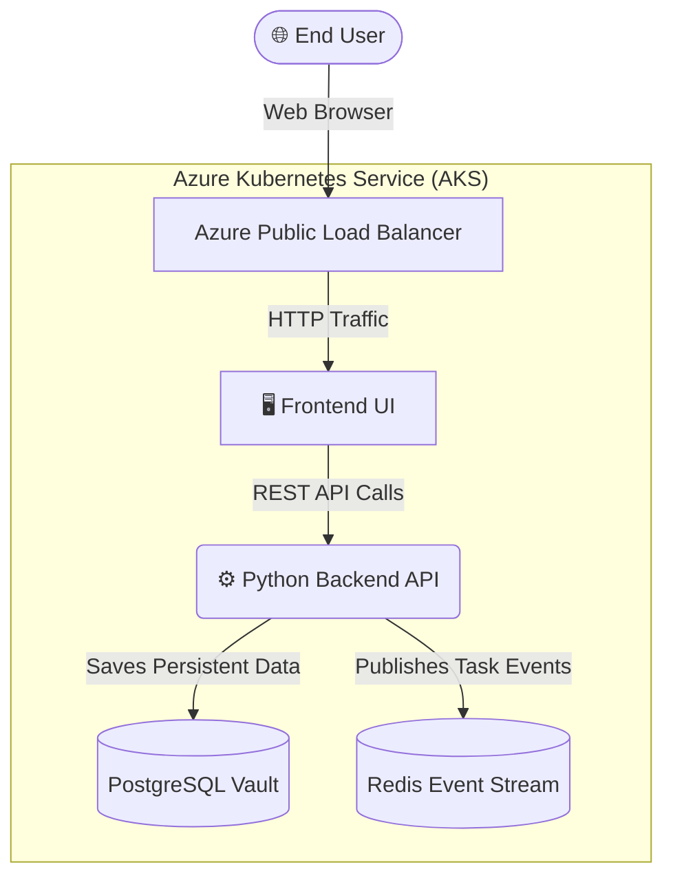

```mermaid
graph TD
    %% High-Level System Architecture
    
    User([🌐 End User]) -->|Web Browser| AzureLB[Azure Public Load Balancer]
    
    subgraph "Azure Kubernetes Service (AKS)"
        AzureLB -->|HTTP Traffic| Frontend[🖥️ Frontend UI]
        
        Frontend -->|REST API Calls| Backend(⚙️ Python Backend API)
        
        Backend -->|Saves Persistent Data| Postgres[(PostgreSQL Vault)]
        Backend -->|Publishes Task Events| Redis[(Redis Event Stream)]
    end
```