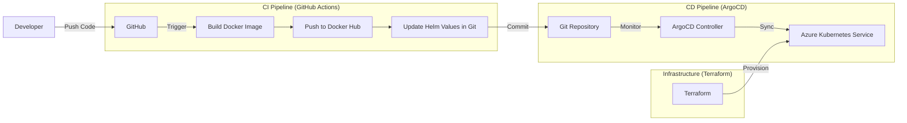

# DevOps Portfolio Project: GitOps with ArgoCD, AKS, and GitHub Actions

This project demonstrates a complete **End-to-End DevOps CI/CD Pipeline** following **GitOps principles**. It deploys a Python FastAPI application to **Azure Kubernetes Service (AKS)**, orchestrated by **ArgoCD** and managed via **Terraform** and **GitHub Actions**.

## 🚀 DevOps Architecture & Workflow

The pipeline is designed to be fully automated and immutable.



### 🛠 Tech Stack

| Component | Tool | Description |
|-----------|------|-------------|
| **Cloud Provider** | Azure (AKS) | Managed Kubernetes Cluster |
| **IaC** | Terraform | Infrastructure provisioning (AKS, VNet, ACR) |
| **CI Pipeline** | GitHub Actions | Builds Docker image, updates Helm manifests |
| **CD / GitOps** | ArgoCD | Syncs Kubernetes state with Git repository |
| **Package Manager** | Helm | Manages Kubernetes application manifests |
| **Containerization** | Docker | Application container runtime |
| **App Framework** | FastAPI | Python backend application |

---

## 🔄 CI/CD Pipeline Details

### 1. Infrastructure as Code (Provisioning)
**Workflow:** `.github/workflows/infra.yaml`
- **Trigger:** Manual (`workflow_dispatch`)
- **Purpose:** bootstraps the entire environment from scratch.
- **Steps:**
    1. **Terraform Apply:** Provisions the Azure Kubernetes Service (AKS) cluster.
    2. **Bootstrap Cluster:**
        - Installs **ArgoCD** via Helm.
        - Applies the Root App configuration.
        - Sets up the database (Postgres).
    3. **Output:** Returns the LoadBalancer IPs for the Application and ArgoCD Dashboard.

### 2. Continuous Integration (CI)
**Workflow:** `.github/workflows/ci-cd.yaml`
- **Trigger:** Push to `master` (changes in `app/`)
- **Purpose:** Builds the artifact and updates the desired state.
- **Steps:**
    1. **Build & Push:** Builds the Docker image and pushes it to Docker Hub with the commit SHA as the tag.
    2. **GitOps Update:** Uses `yq` to update the `image.tag` in `k8s/todo-app/values.yaml`.
    3. **Commit:** Commits the change back to the repository.

### 3. Continuous Deployment (CD - GitOps)
- **Tool:** ArgoCD
- **Mechanism:**
    - ArgoCD watches the `k8s/` directory in this repository.
    - When the CI pipeline commits a new image tag to `values.yaml`, ArgoCD detects the drift.
    - It automatically syncs the cluster state to match the new configuration, deploying the new application version.

---

## 💻 Local Development

To run the application locally without Kubernetes:

```bash
cd app
docker-compose up --build
```
Access the API at `http://localhost:8000/docs`.

---

## ⚙️ Setup & Deployment

### Prerequisites
1. **Azure Service Principal** with Contributor access to the subscription.
2. **GitHub Secrets** configured in the repo:
   - `AZURE_CLIENT_ID`, `AZURE_CLIENT_SECRET`, `AZURE_SUBSCRIPTION_ID`, `AZURE_TENANT_ID`
   - `DOCKERHUB_USERNAME`, `DOCKERHUB_TOKEN`

### Deploying the Infrastructure
Go to the **Actions** tab in GitHub and manually run the **Infrastructure Manager** workflow. Select `apply`.

Once finished, the workflow logs will display:
- **Todo App URL**
- **ArgoCD URL** (with initial admin credentials)

### Deploying Application Updates
Simply make a change to the code in `app/` and push to `master`.
1. GitHub Actions will build the new image.
2. The manifest will be updated.
3. ArgoCD will sync the change to the cluster automatically.
