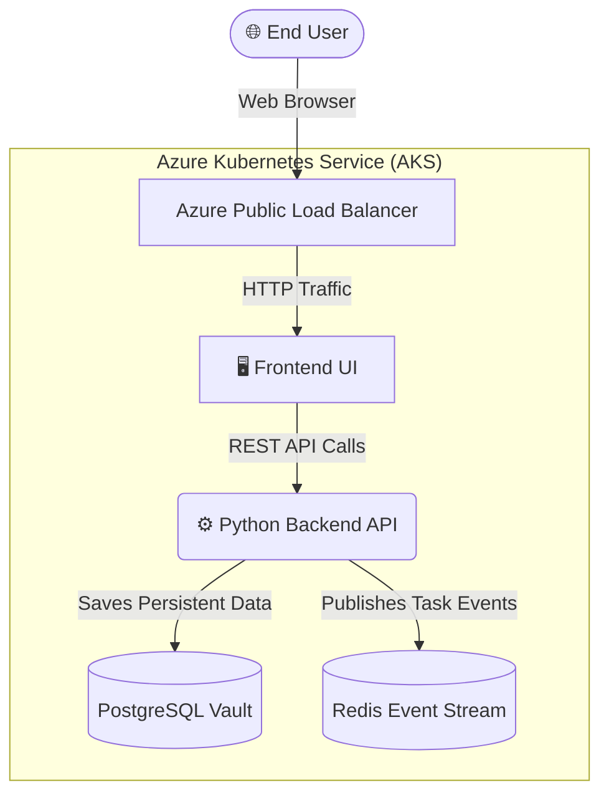
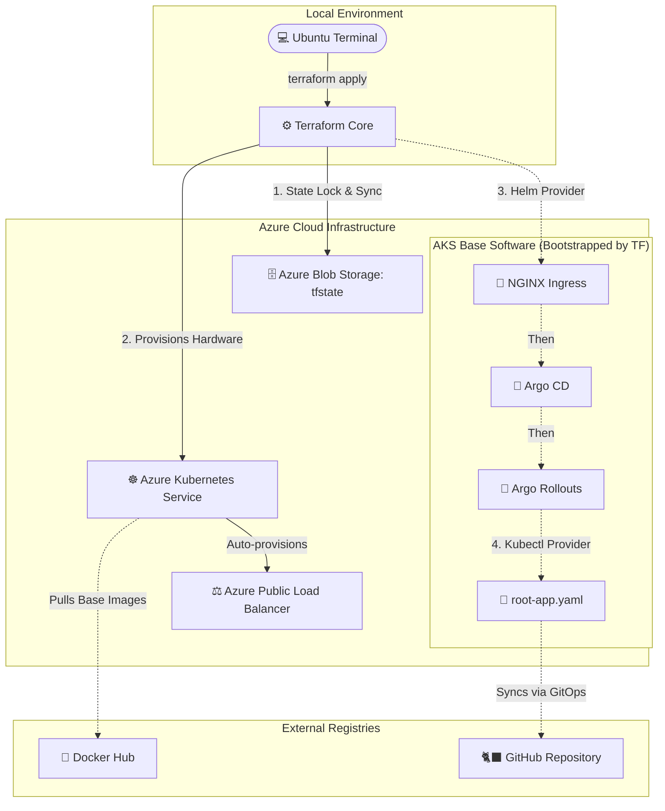
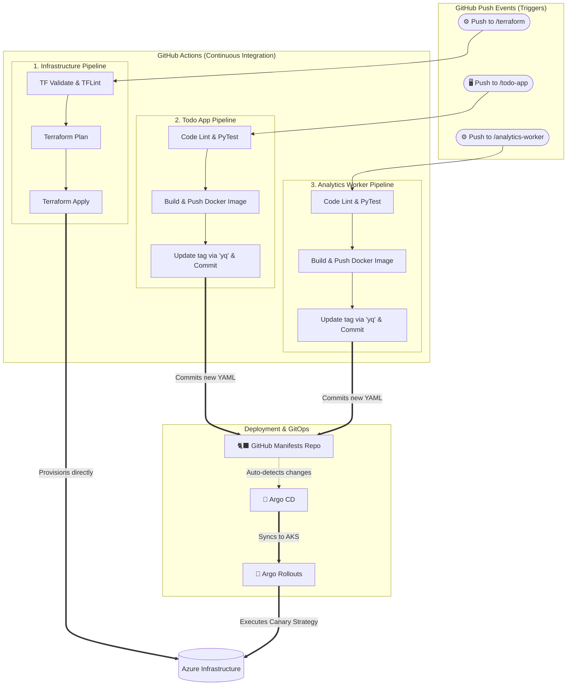

# 🚀 Enterprise GitOps & Event-Driven Architecture on AKS

This repository contains the infrastructure and application code for a cloud-native, event-driven task management system. The project demonstrates enterprise-grade DevOps practices, including Infrastructure as Code (IaC), GitOps deployment strategies, progressive delivery, and decoupled microservice communication.

## 🏗️ 1. High-Level Architecture (The Business View)

The application is decoupled into independent frontend and backend microservices. To guarantee high performance and fault tolerance, synchronous database writes are separated from asynchronous background processing using an event-driven stream.


```mermaid
graph TD
    %% High-Level System Architecture
    
    User([🌐 End User]) -->|Web Browser| AzureLB[Azure Public Load Balancer]
    
    subgraph "Azure Kubernetes Service (AKS)"
        AzureLB -->|HTTP Traffic| Frontend[🖥️ Frontend UI]
        
        Frontend -->|REST API Calls| Backend(⚙️ Python Backend API)
        
        Backend -->|Saves Persistent Data| Postgres[(PostgreSQL Vault)]
        Backend -->|Publishes Task Events| Redis[(Redis Event Stream)]
    end
```

## ☁️ 2. Cloud Infrastructure (The Terraform View)
The foundational infrastructure is provisioned on Microsoft Azure using Terraform. State is securely managed remotely to prevent team conflicts. Once the hardware is provisioned, Terraform seamlessly bootstraps the cluster with the required GitOps controllers before handing over deployment authority.


```mermaid
graph TD
    subgraph Local["Local Environment"]
        Terminal([💻 Ubuntu Terminal]) -->|terraform apply| TF[⚙️ Terraform Core]
    end

    subgraph Azure["Azure Cloud Infrastructure"]
        TF -->|1. State Lock & Sync| Blob[🗄️ Azure Blob Storage: tfstate]
        
        TF -->|2. Provisions Hardware| AKS[☸️ Azure Kubernetes Service]
        AKS -->|Auto-provisions| ALB[⚖️ Azure Public Load Balancer]
        
        subgraph Bootstrapped["AKS Base Software (Bootstrapped by TF)"]
            TF -.->|3. Helm Provider| Nginx[🚦 NGINX Ingress]
            Nginx -.->|Then| ArgoCD[🐙 Argo CD]
            ArgoCD -.->|Then| Rollouts[🌊 Argo Rollouts]
            Rollouts -.->|4. Kubectl Provider| RootApp[📄 root-app.yaml]
        end
    end

    subgraph External["External Registries"]
        AKS -.->|Pulls Base Images| DockerHub[🐳 Docker Hub]
        RootApp -.->|Syncs via GitOps| GitHub[🐈‍⬛ GitHub Repository]
    end
```
## 🔄 3. CI/CD & Progressive Delivery (The GitOps View)
To eliminate manual deployment errors, this project utilizes a strict GitOps workflow. Code changes trigger parallel GitHub Actions pipelines that lint, test, and build the artifacts. Argo CD detects repository changes and triggers Argo Rollouts to execute safe, progressive Canary deployments in the cluster.


```mermaid 
flowchart TD
    %% EVENT TRIGGERS
    subgraph Triggers ["GitHub Push Events (Triggers)"]
        PushTF([⚙️ Push to /terraform])
        PushTodo([🖥️ Push to /todo-app])
        PushWorker([⚙️ Push to /analytics-worker])
        
        %% Align triggers horizontally
        PushTF ~~~ PushTodo ~~~ PushWorker
    end

    %% GITHUB ACTIONS PIPELINES
    subgraph CI ["GitHub Actions (Continuous Integration)"]
        
        subgraph TF_Pipe ["1. Infrastructure Pipeline"]
            TF_Lint[TF Validate & TFLint] --> TF_Plan[Terraform Plan] --> TF_Apply[Terraform Apply]
        end

        subgraph Todo_Pipe ["2. Todo App Pipeline"]
            Todo_Test[Code Lint & PyTest] --> Todo_Build[Build & Push Docker Image] --> Todo_Tag[Update tag via 'yq' & Commit]
        end

        subgraph Worker_Pipe ["3. Analytics Worker Pipeline"]
            Worker_Test[Code Lint & PyTest] --> Worker_Build[Build & Push Docker Image] --> Worker_Tag[Update tag via 'yq' & Commit]
        end
        
        %% Force horizontal alignment of the top boxes
        TF_Lint ~~~ Todo_Test ~~~ Worker_Test
    end

    %% CONNECTIONS: TRIGGERS TO PIPELINES
    PushTF --> TF_Lint
    PushTodo --> Todo_Test
    PushWorker --> Worker_Test

    %% DEPLOYMENT & GITOPS FLOW
    subgraph CD ["Deployment & GitOps"]
        Repo[🐈‍⬛ GitHub Manifests Repo]
        Argo[🐙 Argo CD]
        Rollouts[🌊 Argo Rollouts]
        
        Repo -.->|Auto-detects changes| Argo
        Argo ===>|Syncs to AKS| Rollouts
    end

    %% TARGET PLATFORM
    Azure[(Azure Infrastructure)]

    %% CONNECTIONS: CI TO CD
    Todo_Tag ===>|Commits new YAML| Repo
    Worker_Tag ===>|Commits new YAML| Repo
    
    %% FINAL DEPLOYMENT CONNECTIONS
    TF_Apply ===>|Provisions directly| Azure
    Rollouts ===>|Executes Canary Strategy| Azure
```
## 🛠️ Technology Stack
* **Cloud Provider:** Microsoft Azure
* **Infrastructure as Code:** Terraform
* **Container Orchestration:** Kubernetes (AKS)
* **GitOps & Delivery:** Argo CD, Argo Rollouts
* **Ingress & Routing:** NGINX Ingress Controller
* **Application Layer:** Python (FastAPI)
* **Databases:** PostgreSQL, Redis Streams
* **CI/CD:** GitHub Actions

---

## 📂 Repository Structure

```text
├── .github/workflows/   # CI/CD Pipelines (Terraform, App, Worker)
├── app/                 # Python source code (Todo API & Analytics Worker)
├── k8s/                 # Kubernetes Manifests (ArgoCD apps, Ingress, Rollouts)
├── terraform/           # Infrastructure as Code (AKS, Networking, State)
├── docs/                # Extended architectural documentation
└── README.md