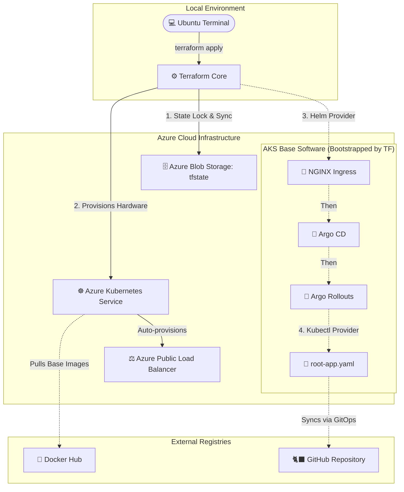

```mermaid
graph TD
    subgraph Local["Local Environment"]
        Terminal([💻 Ubuntu Terminal]) -->|terraform apply| TF[⚙️ Terraform Core]
    end

    subgraph Azure["Azure Cloud Infrastructure"]
        %% Swapped cylinder for a standard box with an emoji
        TF -->|1. State Lock & Sync| Blob[🗄️ Azure Blob Storage: tfstate]
        
        TF -->|2. Provisions Hardware| AKS[☸️ Azure Kubernetes Service]
        AKS -->|Auto-provisions| ALB[⚖️ Azure Public Load Balancer]
        
        subgraph Bootstrapped["AKS Base Software (Bootstrapped by TF)"]
            %% Chaining them shows the actual installation sequence
            TF -.->|3. Helm Provider| Nginx[🚦 NGINX Ingress]
            Nginx -.->|Then| ArgoCD[🐙 Argo CD]
            ArgoCD -.->|Then| Rollouts[🌊 Argo Rollouts]
            Rollouts -.->|4. Kubectl Provider| RootApp[📄 root-app.yaml]
        end
    end

    subgraph External["External Registries"]
        AKS -.->|Pulls Base Images| DockerHub[🐳 Docker Hub]
        RootApp -.->|Syncs via GitOps| GitHub[🐈‍⬛ GitHub Repository]
    end
```